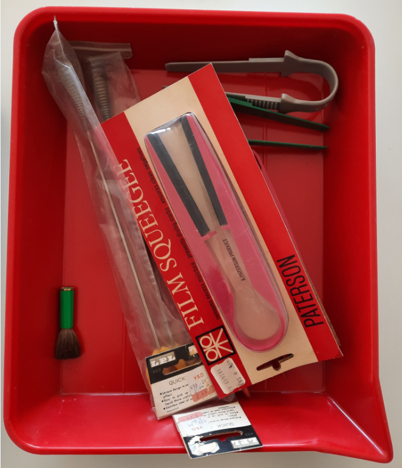

 
 
 

#  darkRoom
Dark room equipment for black & white film photography

----

## The Tank

 

 

----

## Safety light

 

 

## Volumetric tube

 

 

 

 

## Twizzers and squigges

 

 

----

## Bath for paper development
 

 

 

 

## Timer

 

 

## Thermometer

 

 

## Contact proof printer 

 35mm film
 

 

----
for 120 film

 

 

## Books

 

 

----

 

 

----
## Paterson Catalogue

 

 

 

 

----

 

 

----

 

 

----

## Film dust remover
 

 

----

