 
 
 

#  darkRoomAthens 
Dark room equipment for black & white film photography.

This is a dark-room set, I was given from a good friend. 

The equipment is kind of vintage, but at good quality and exactly what neeeded to start with  film photography dark-room

----

## The Tank
Can develop both 35mm and 120 films

 

 

----

## Safety light
This is the red light bulb
 

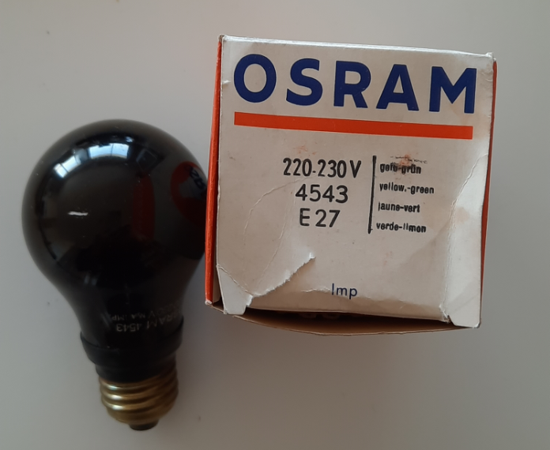

 

## Volumetric tube

 

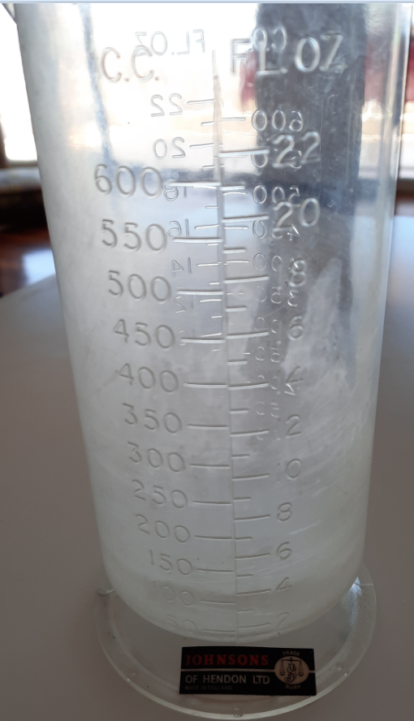
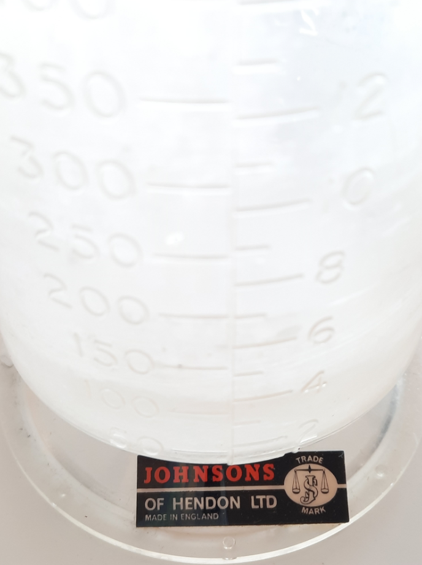

 

## Twizzers and squigges

 

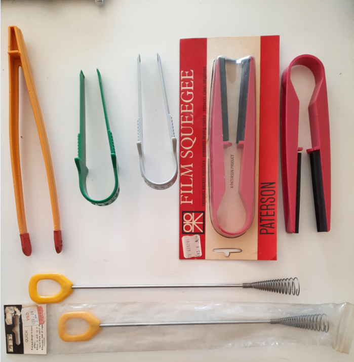

 

----

## Bath for paper development

 

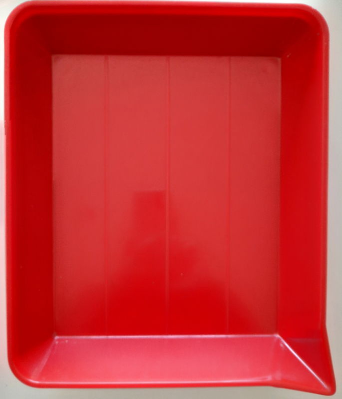

 

## Timer

 

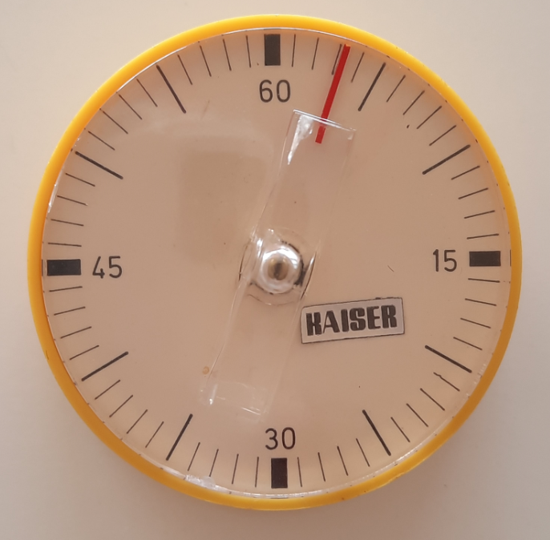

 

## Thermometer

 

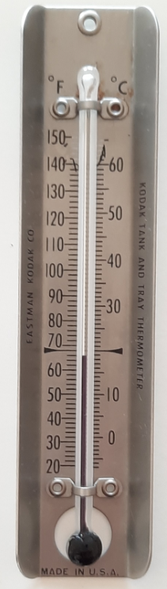

 

## Contact proof printer 

 35mm film
 

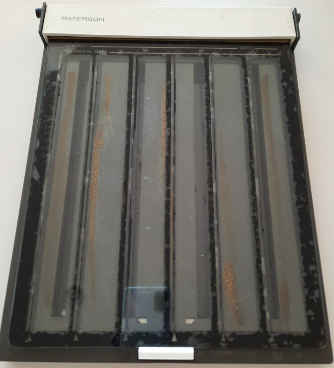

 

----
for 120 film

 

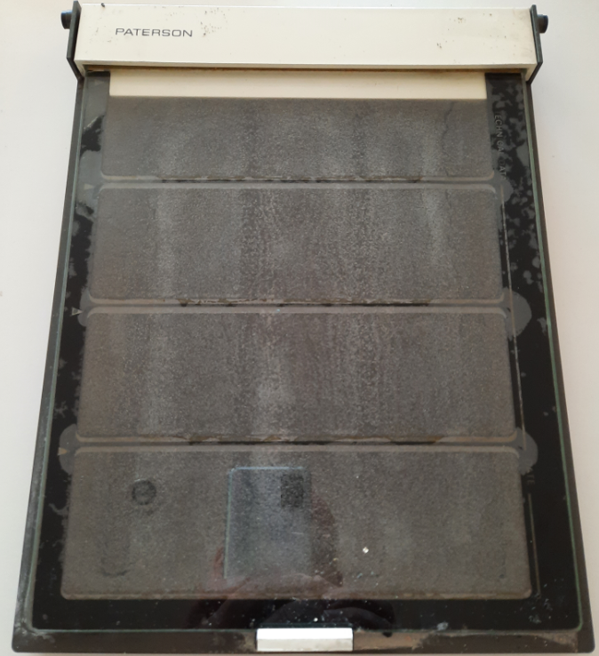

 

## Film dust remover

 

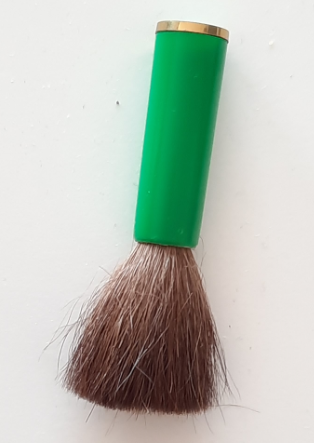

 

----

## Books

 

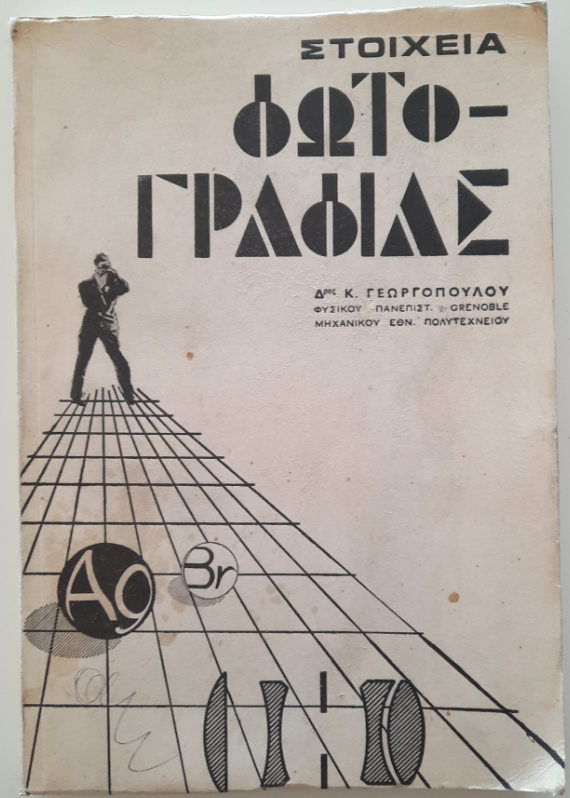

 

----

 

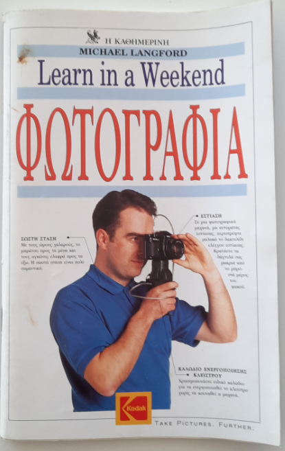

 

----
## Paterson Catalogue
from 1967!!!
 

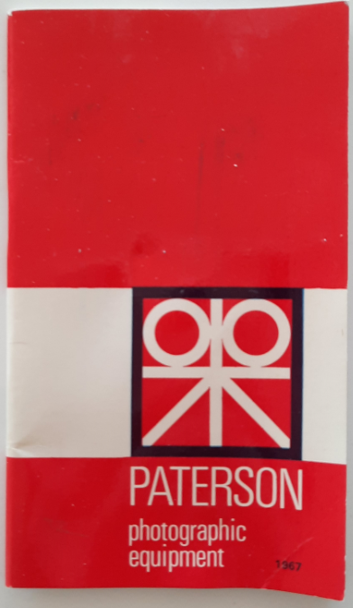

 

 

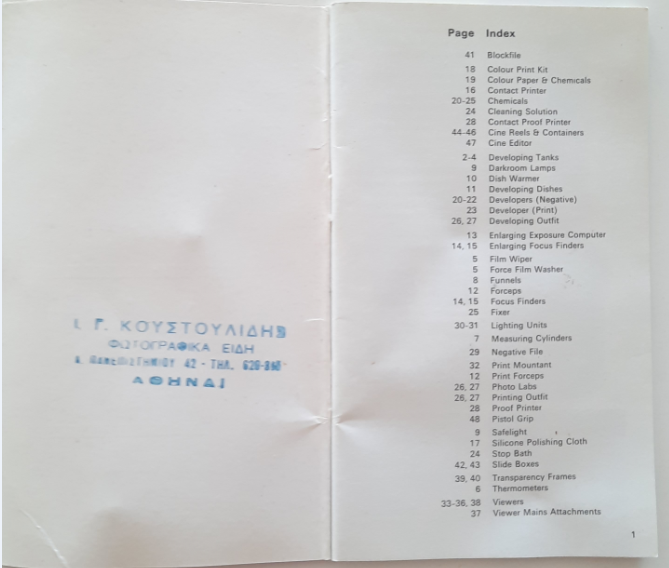

 

 

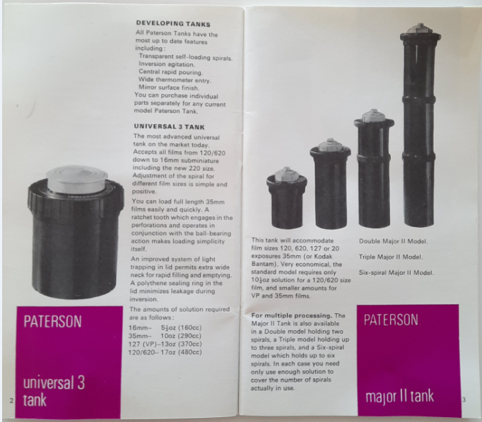

 

----

